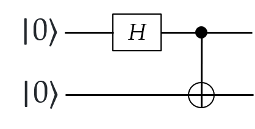
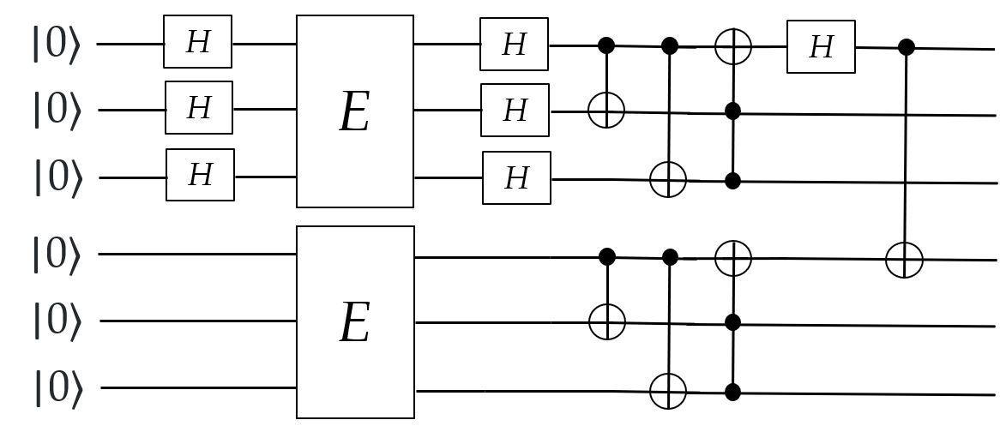

# Qosf Screening Task 
## Task 2
1) Build the following simple circuit to prepare the Bell state <br/><br/> 

2) Now add, right before the CNOT gate and for each of the two qubits, an arbitrary “error gate”. By error gate we mean that with a certain probability (that you can decide but      must be non-zero for all the choices) you have a 1 qubit unitary which can be either the identity, or the X gate (bit-flip error) [[1]](https://en.wikipedia.org/wiki/Quantum_error_correction) or the Z gate (sign-flip error) [[1]](https://en.wikipedia.org/wiki/Quantum_error_correction).
3) Encode each of the two qubits with a sign-flip or a bit-flip code, in such a way that all the possible choices for the error gates described in 2), occurring on the logical        qubits, can be detected and fixed.
4) Test your solution by making many measurements over the final state and testing that the results are in line with the expectations.

The Bell state (|00〉 + |11〉)/sqrt(2), which is a maximally entangled state, is created by initialising
the two qubit input state |00〉 and applying a Hadamard gate to the first qubit and a CNOT gate with 
first qubit as control input and second qubit as target input [[2]](https://en.wikipedia.org/wiki/Bell_state). In this task, an error gate is added to
each of the two qubits before the CNOT gate. The error can be a bit-flip error (X gate), sign-flip 
error (Z gate) or an identity gate. Each of the two qubits are encoded using bit-flip or sign-flip code
and are subsequently measured in Z basis.

The first qubit state |0〉 is encoded using only sign-flip code because after applying Hadamard gate, a sign-flip error
would flip |+〉 to |-〉 but a bit-flip error would leave the state |+〉 unchanged. Similarly, the second qubit state |0〉 
is encoded using only bit-flip code because a sign-flip error would leave the state |0〉 unchanged. This eliminates the 
implementation of Shor Code [[3]](https://cds.cern.ch/record/465953/files/0521635039_TOC.pdf) to both of the input qubit states. Hence, the problem is simplified to encoding the 
first qubit state |+〉 as |+++〉 and the second qubit state |0〉 as |000〉. Now since the encoded states are only |+++〉
and |000〉, this eliminates the application of CNOTs during encoding for the sign-flip and bit-flip code:<br/><br/>


```[1]```: [https://en.wikipedia.org/wiki/Quantum_error_correction](https://en.wikipedia.org/wiki/Quantum_error_correction) <br/>
```[2]```: [https://en.wikipedia.org/wiki/Bell_state](https://en.wikipedia.org/wiki/Bell_state) <br/>
```[3]```: [Nielsen, M. A., and I. L. Chuang, 2000, Quantum Computation and Quantum Information (Cambridge University
Press,Cambridge)](https://cds.cern.ch/record/465953/files/0521635039_TOC.pdf) <br/>

## Task 2 Code Sample
The code sample is illustrated in python as well as in Q#.
### Python Code Sample 
#### .python

[Task_2.py](): Python code implementing functions for error-correcting code of the sample.<br/>
[UnitTests.py](): Python code (__main__) for unit tests of the sample. <br/>

#### Installation 

Install Qiskit by a python package manager tool - pip: <br/> 
```
pip install qiskit
```

### Q# Code Sample

#### .qsharp

[ProgramTask_2.qs](): Q# code implementing quantum operations of the sample.<br/>
[BellStateCode.qs](): Q# entry point to test whether results are in line with the expectations of the sample.<br/>

#### Installation

Install Microsoft's qdk product - [Quantum Development Kit](https://docs.microsoft.com/en-us/azure/quantum/install-overview-qdk). <br/>
Install [.NET Core SDK 3.1](https://dotnet.microsoft.com/download)

#### Command to run Q# code
```
dotnet run
```

